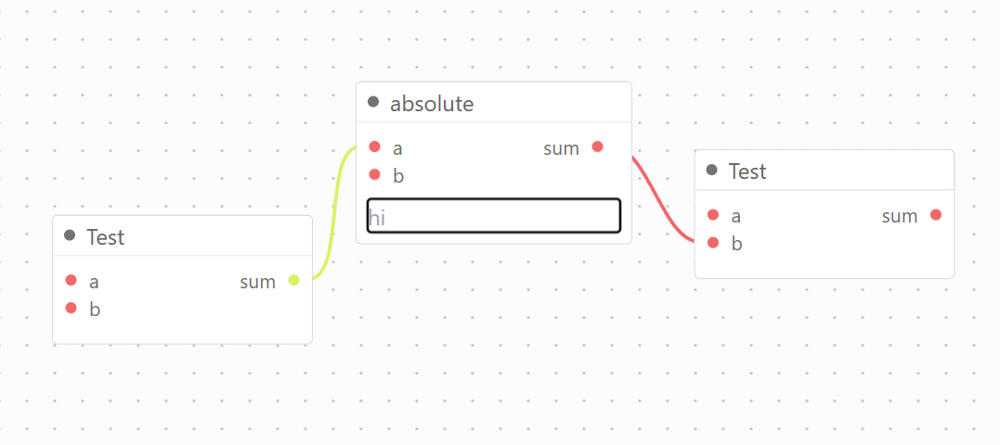

# Kuflow

A visual node-editor engine for building graph-based workflows in the browser. Renders draggable nodes with typed input/output ports, connects them with curved SVG edges, and enforces acyclic graph constraints. Built on D3.js.

<center></center>

## Installation

```bash
npm install kuflow
# or
yarn add kuflow
```

Import the stylesheet somewhere in your app:

```ts
import 'kuflow/css'
```

## Quick Start

```html
<div id="kuflow" style="width: 100vw; height: 100vh;"></div>
```

```ts
import 'kuflow/css'
import { Kuflow } from 'kuflow'
import { NodeBasic, NodePort } from 'kuflow/renderable'

const kuflow = new Kuflow({
  parent: document.querySelector<HTMLDivElement>('#kuflow')!,
})

kuflow.add(new NodeBasic('node-1', {
  title: 'Input',
  position: { x: 80, y: 120 },
  ports: {
    input: [],
    output: [new NodePort('n1-out', 'Value', ['string'])],
  },
  onMount(body) {
    body.innerHTML = `<input name="value" type="text" placeholder="Enter value" />`
  },
}))

kuflow.add(new NodeBasic('node-2', {
  title: 'Output',
  position: { x: 350, y: 120 },
  ports: {
    input: [new NodePort('n2-in', 'Value', ['string'])],
    output: [],
  },
}))

kuflow.connect('n1-out', 'n2-in')
```

## Core Concepts

| Concept        | Description                                                                 |
| -------------- | --------------------------------------------------------------------------- |
| `Kuflow`       | Main orchestrator. Attach to a `<div>` container.                           |
| `NodeBasic`    | A draggable node with input/output ports and an optional form body.         |
| `NodePort`     | A typed connection point on a node.                                         |
| `Edge`         | A curved SVG path connecting two ports (managed internally).                |
| `NodeRegistry` | Optional registry for reusable node type definitions.                       |

**Port type matching:** An edge can only connect an output port to an input port when the output's first `dataType` is included in the input's `dataType` array.

## API

### `new Kuflow(config)`

| Option                     | Type             | Description                                   |
| -------------------------- | ---------------- | --------------------------------------------- |
| `parent`                   | `HTMLDivElement` | Container element (required)                  |
| `disablePatternBackground` | `boolean`        | Hide the dot-grid background                  |
| `registry`                 | `NodeRegistry`   | Enable `createNode()` from type definitions   |
| `model`                    | `object`         | Restore a previously exported graph state     |

### `kuflow.add(node)`

Mounts a `NodeBasic` to the canvas and returns it.

### `kuflow.remove(node)`

Removes a node and all its connected edges.

### `kuflow.connect(outputPortId, inputPortId)`

Programmatically connect two ports. Validates types, prevents duplicate inputs, and rejects cyclic connections.

### `kuflow.createNode(type, options?)`

Instantiate a node from the registry by type name. Requires a `NodeRegistry` in config.

```ts
kuflow.createNode('math/add', { position: { x: 200, y: 100 } })
```

### `kuflow.export()`

Serialize the full graph state to a plain object.

```ts
const graph = kuflow.export()
// { x, y, k, nodes: [...], edges: [...] }
```

### `kuflow.addEventListener(event, callback)`

Subscribe to an event. Returns an unsubscribe function.

```ts
const off = kuflow.addEventListener('node.focus', (node, toolbar) => {
  console.log('focused:', node.id)
})
off() // unsubscribe
```

**Available events:**

| Event           | Payload                                 | Description                              |
| --------------- | --------------------------------------- | ---------------------------------------- |
| `zoom`          | `{ x, y, k }`                          | Fired on scroll-wheel zoom               |
| `pan`           | `{ x, y, k }`                          | Fired on drag pan                        |
| `zoom-pan`      | `{ x, y, k }`                          | Fired on both zoom and pan               |
| `node.focus`    | `(node, toolbarEl)`                    | A node was clicked or dragged            |
| `node.error`    | `{ nodeId, param?, port?, message }`   | An error was added to a node             |
| `canvas.update` | —                                       | Fired each render frame with dirty nodes |
| `port.mousedown`| `PortMouseDownEvent`                    | Mouse pressed on a port                  |
| `port.mousemove`| `MouseEvent`                            | Mouse moved over the canvas              |
| `port.mouseup`  | `MouseEvent`                            | Mouse released over the canvas           |

### `kuflow.error / clearErrors`

Attach or clear validation errors on a node. Nodes with errors show a red ring automatically.

```ts
kuflow.error('node-1', { param: 'label', message: 'Required' })
kuflow.error('node-1', { port: 'n1-in',  message: 'Type mismatch' })
kuflow.clearErrors('node-1')

kuflow.hasErrors('node-1')  // boolean
kuflow.getErrors('node-1')  // NodeError[]
```

### `node.validate()`

Runs the node's `onValidate` callback and returns `true` if no errors were recorded. Awaits async `onMount` completion first (e.g. React roots).

```ts
const valid = await node.validate() // true | false
```

### `kuflow.destroy()`

Disconnects observers and removes the editor from the DOM.

## Node Registry

Define reusable node types once and instantiate them by name.

```ts
import { Kuflow, NodeRegistry } from 'kuflow'

const registry = new NodeRegistry()

registry.define({
  type: 'math/add',
  title: 'Add',
  inputs:  [{ label: 'A', dataType: ['number'] }, { label: 'B', dataType: ['number'] }],
  outputs: [{ label: 'Result', dataType: ['number'] }],
  body(form) {
    form.innerHTML = `<input name="label" type="text" placeholder="Label" />`
  },
  execute({ A, B }) {
    return { Result: A + B }
  },
})

const kuflow = new Kuflow({ parent: container, registry })
kuflow.createNode('math/add', { position: { x: 200, y: 100 } })
```

## Saving & Restoring State

```ts
// Save on every change
kuflow.addEventListener('canvas.update', () => {
  localStorage.setItem('graph', JSON.stringify(kuflow.export()))
})

// Restore on load
const saved = JSON.parse(localStorage.getItem('graph') ?? 'null')
const kuflow = new Kuflow({ parent: container, model: saved ?? undefined })
```

## CSS Theming

Override these CSS custom properties on the container or globally:

```css
#kuflow {
  --kuflow-background: #1a1a2e;
  --kuflow-foreground: #e0e0e0;
  --kuflow-grid:       #2a2a4a;
}
```

## Framework Guides

- [Vanilla JS / TypeScript](./docs/vanilla.md)
- [React](./docs/react.md)
- [Svelte](./docs/svelte.md)
- [API Reference](./docs/api.md)

## Development

```bash
yarn dev    # dev server at localhost:5000
yarn build  # build library to dist/
```

## Package Exports

| Import path         | Contents                                                    |
| ------------------- | ----------------------------------------------------------- |
| `kuflow`            | `Kuflow`, `NodeRegistry`, types, utilities                  |
| `kuflow/renderable` | `Renderable`, `NodeBasic`, `NodePort`, `Edge`, `GroupNode`  |
| `kuflow/css`        | Stylesheet                                                  |
